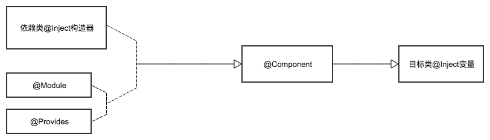

# Dagger2
##### Dependency Injection (依赖注入)
----
`project gradle`
```java
classpath 'com.neenbedankt.gradle.plugins:android-apt:1.4'
```
`gradle`
```java
compile 'com.google.dagger:dagger:2.0'
annotationProcessor 'com.google.dagger:dagger-compiler:2.0'
compile 'org.glassfish:javax.annotation:10.0-b28'
```
## @Inject
> 一是用来标记需要依赖的变量，以此告诉Dagger2为它提供依赖；二是用来标记构造函数，Dagger2通过`@Inject`注解可以在需要这个类实例的时候来找到这个构造函数并把相关实例构造出来，以此来为被`@Inject`标记了的变量提供依赖；`@Inject`标记的变量不能用`private`修饰

- 标注目标类属性：
```java
public class MainActivity extends AppComActivity{

    @Inject
    MainPresenter mainPresenter;

}
```
- 标注被依赖类的构造器：
```java
public class MainPresenter {

    @Inject
    public MainPresenter (){

    }
}
```
## @Component
> 用于标注接口，是依赖需求方和依赖提供方之间的桥梁。在`Component`中定义注入方法(推荐方法名为injectXXX)被`Component`标注的接口在编译时会生成该接口的实现类（如果`@Component`标注的接口为`PersonComponent`，则编译期生成的实现类为`DaggerPersonComponent`）,我们通过调用这个实现类的方法完成注入；

- `@Component`可以设置`modules`属性指定需要依赖的`Module`(`@Component (modules = {CarModule.class})`)
- `@Component`可以设置`dependencies`属性去依赖其它的`Component`(`@Component (dependencies = {MainComponent.class})`)

```java
@Component
public interface MainComponent {
    void inject (MainActivity mainActivity);
}
```
## @Module
> 用于标注提供依赖的管理类。为什么还需要`@Module`？很多时候我们需要提供依赖的构造函数是第三方库的，我们没法给它加上`@Inject`注解，又比如说提供以来的构造函数是带参数的，如果我们之所简单的使用`@Inject`标记它，那么他的参数又怎么来呢？`@Module`正是帮我们解决这些问题的,在`@Module`内创建提供依赖的实例的方法，`@Module`需要配合`@Provides`使用

## @Provides
> 用于标注`@Module`所标注的类中的用于提供依赖实例的方法，该方法在需要提供依赖时被调用，从而把预先提供好的对象当做依赖给标注了`@Inject`的变量赋值；

#### eg:
`MainActivity`依赖`Car` ,`Car`依赖`Engine` ,`Engine`依赖`Gear`

`Gear`类:
```java
public class Gear {

    public Gear(){

    }

    public void start(){
        Logger.d("gear normal");
    }
}
```
`Engine`类，构造时需要传入`Gear`
```java
public class Engine {

    private Gear gear;

    public Engine(Gear gear){
        this.gear = gear;
    }

    public void start(){
        Logger.d("engine start run");
        gear.start();
    }
}
```
`Car`类，构造时需要传入`Engine`
```java
public class Car {

    private Engine engine;

    public Car (Engine engine){
        this.engine = engine;
    }

    public void start(){
        engine.start();
    }
}
```
提供`Car`对象给目标类依赖的`CarModule`:
```java
@Module
public class CarModule {

    /**
     * new一个gear对象通过provide提供给dagger2
     * @return
     */
    @Provides
    public Gear provideGear(){
        return new Gear();
    }

    /**
     * 此处在提供engine的provider中填入的参数gear会自动调用上面的provideGear提供的gear
     * @param gear
     * @return
     */
    @Provides
    public Engine provideEngine(Gear gear){
        Engine engine = new Engine(gear);
        return engine;
    }

    /**
     * 此处在提供car的provider中填入的参数engine会自动调用上面的provideEngine提供的engine
     * @param engine
     * @return
     */
    @Provides
    public Car provideCar(Engine engine){
        Car car = new Car(engine);
        return car;
    }
}
```
连接目标类和依赖提供的`Component`
```java
@Component (modules = {CarModule.class})
public interface CarComponent {
    Car getCar();
}
```
目标类中调用：
```java
CarComponent c = DaggerCarComponent.builder().carModule(new CarModule()).build();
car = c.getCar();
car.start();
```
##### 也可以使用`@Inject`的方式调用：

修改`Component`:
```java
@Component (modules = {CarModule.class})
public interface CarComponent {
    void inject (MainActivity mainActivity);
}
```
在`Gear`, `Engine`, `Car` 的构造器上增加`@Inject`注解
```java
@Inject
public Gear(){}
```
```java
@Inject
public Engine(Gear gear){
    this.gear = gear;
}
```
```java
@Inject
public Car (Engine engine){
    this.engine = engine;
}
```
目标类将`car`作为属性加`@Inject`注解
```java
@Inject
Car car;
```
将`Component`初始化后使用
```java
DaggerCarComponent.builder().carModule(new CarModule()).build().inject(this);
//当Module只有一个默认的无参数的构造器时可以用下面的语句直接create，不需要调用xxxModule方法
//DaggerCarComponent.create().inject(this);
car.start();
```

## @Qualifier
> 用于自定义注解，也就是说`@Qualifier`就如同`Java`提供的几种基本元注解一样用来标记注解类。我们在使用`@Module`来标注提供依赖的方法时，方法名我们是可以随便定义的（虽然我们定义方法名一般以`provide`开头，但这并不是强制的，只是为了增加可读性而已）。那么Dagger2怎么知道这个方法是为谁提供依赖呢？答案就是返回值的类型，Dagger2根据返回值的类型来决定为哪个被`@Inject`标记了的变量赋值。但是问题来了，一旦有多个一样的返回类型Dagger2就懵逼了。`@Qualifier`的存在正是为了解决这个问题，我们使用`@Qualifier`来定义自己的注解，然后通过自定义的注解去标注提供依赖的方法和依赖需求方（也就是被`@Inject`标注的变量），这样Dagger2就知道为谁提供依赖了。----一个更为精简的定义：当类型不足以鉴别一个依赖的时候，我们就可以使用这个注解标示；

###### eg1：被依赖类构造需要传入参数，自定义注解根据参数不同提供不同的对象
`CellPhone`类，构造器根据传入参数不同设置成不同的型号
```java
public class CellPhone {

    private int model;

    public CellPhone(int model) {
        this.model = model;
    }

    public void call(){
        Logger.d("iphone"+model+" is calling");
    }
}
```
`Person`类依赖`CellPhone`类：
```java
public class Person {

    private CellPhone cellPhone;

    public Person(CellPhone cellPhone) {
        this.cellPhone = cellPhone;
    }

    public void call(){
        Logger.d("person pick up the phone");
        cellPhone.call();
    }
}
```
创建`PersonModule`类，组织被依赖对象
```java
@Module
public class PersonModule {
    //定义2个注解 @i6  @i7分别对应不同的CellPhone Provides,代表提供不同的CellPhone 对象
    @Qualifier
    @Retention(RetentionPolicy.RUNTIME)
    public @interface i6{}

    @Qualifier
    @Retention(RetentionPolicy.RUNTIME)
    public @interface i7{}

    @Provides
    @i6
    CellPhone provideI6(){
        return new CellPhone(6);
    }

    @Provides
    @i7
    CellPhone provideI7(){
        return new CellPhone(7);
    }

    //因为person依赖cellPhone , 在此provides中通过自定义的注解确定提供那一个cellPhone对象
    //同样道理也可以定义2个不同的person 注解，提供2个不同的person ，在目标类的@Inject 属性上也需要加上相同的自定义注解
    @Provides
    Person providePerson(@i7 CellPhone cellPhone){
        return new Person(cellPhone);
    }
}
```
创建`PersonComponent`类，连接目标类和被依赖类：
```java
@Component (modules = PersonModule.class)
public interface PerComponent {
    void inject(MainActivity mainActivity);
}
```
`MainActivity`中调用：
```java
public class MainActivity extends AppCompatActivity {

    //如果有自定义注解提供不同的Person，这里也要加上需要的对象对应的自定义注解
    @Inject
    Person p;

    @Override
    protected void onCreate(Bundle savedInstanceState) {
        super.onCreate(savedInstanceState);
        setContentView(R.layout.activity_main);

        DaggerPerComponent.create().inject(this);
        p.call();
    }
}
```
###### eg2: 被依赖类时接口或抽象类，自定义注解提供不同的实现类
`CellPhone`接口：
```java
public interface CellPhone {
    void call();
}
```
`CellPhone`接口的两个实现类`IPone6` , `Iphone7`:
```java
public class IPhone6 implements CellPhone {
    @Override
    public void call() {
        Logger.d("iphone6 is calling");
    }
}
```
```java
public class IPhone7 implements CellPhone {
    @Override
    public void call() {
        Logger.d("iphone7 is calling");
    }
}
```
`Person`类依赖`CellPhone`:
```java
public class Person {

    private CellPhone cellPhone;

    public Person(CellPhone cellPhone) {
        this.cellPhone = cellPhone;
    }

    public void call(){
        Logger.d("person pick up the phone");
        cellPhone.call();
    }
}
```
`PersonModule`组织被依赖对象
```java
@Module
public class PersonModule {

    @Qualifier
    @Retention(RetentionPolicy.RUNTIME)
    public @interface i6{}

    @Qualifier
    @Retention(RetentionPolicy.RUNTIME)
    public @interface i7{}

    @Provides
    @i6
    CellPhone provideI6(){
        return new IPhone6();
    }

    @Provides
    @i7
    CellPhone provideI7(){
        return new IPhone7();
    }

    @Provides
    Person providePerson(@i6 CellPhone cellPhone){
        return new Person(cellPhone);
    }
}
```
`PersonComponent`类，连接目标类和被依赖类：
```java
@Component (modules = PersonModule.class)
public interface PerComponent {
    void inject(MainActivity mainActivity);
}
```
`MainActivity`中调用：
```java
public class MainActivity extends AppCompatActivity {

    @Inject
    Person p;

    @Override
    protected void onCreate(Bundle savedInstanceState) {
        super.onCreate(savedInstanceState);
        setContentView(R.layout.activity_main);

        DaggerPerComponent.create().inject(this);
        p.call();
    }
}
```
###### 另外一种调用方法：
修改Component:
```java
@Component (modules = PersonModule.class)
public interface PerComponent {
    Person getPerson();
}
```
修改调用：
```java
public class MainActivity extends AppCompatActivity {

    @Inject
    Person p;

    @Override
    protected void onCreate(Bundle savedInstanceState) {
        super.onCreate(savedInstanceState);
        setContentView(R.layout.activity_main);
        Logger.init("----px----");
        p = DaggerPerComponent.create().getPerson();
        p.call();
    }
}
```

## @Scope
> 同样用于自定义注解，我能可以通过`@Scope`自定义的注解来限定注解作用域，实现局部的单例；
###### eg:在2个activity中都调用Test对象，要求Test对于这2个activity是单例的
`Test`类
```java
public class Test {

    public void test(){
        Logger.d("start test");
    }
}
```
`TestModule`类，在此用`@Scope`自定义一个注解`@SingleTest`，将此注解标注到`Test`的`provide`上
```java
@Module
public class TestModule {

    @Scope
    @Retention(RetentionPolicy.RUNTIME)
    public @interface SingleTest{}

    @Provides
    @SingleTest
    Test provideTest(){
        return new Test();
    }
}
```
`Component`中定义需要注入的两个目标`activity` ，并在`Component`上标注`@SingleTest`
```java
@TestModule.SingleTest
@Component (modules = {TestModule.class})
public interface TestComponent {
    void inject (MainActivity mainActivity);
    void inject (Main2Activity main2Activity);
}
```
在全局的`Application`中初始化`TestComponent`并提供`get`方法
```java
public class Application extends android.app.Application{

    private TestComponent testComponent;

    @Override
    public void onCreate() {
        super.onCreate();
        testComponent = DaggerTestComponent.create();
    }

    public TestComponent getTestComponent(){
        return testComponent;
    }
}
```
在两个`activity`中分别调用：
```java
public class MainActivity extends AppCompatActivity {

    @Inject
    Test test;

    private Button btToMain2;

    @Override
    protected void onCreate(Bundle savedInstanceState) {
        super.onCreate(savedInstanceState);
        setContentView(R.layout.activity_main);
        Logger.init("----px----");
        btToMain2 = (Button) findViewById(R.id.bt_to_main2);
        btToMain2.setOnClickListener(new View.OnClickListener() {
            @Override
            public void onClick(View v) {
                startActivity(new Intent(MainActivity.this , Main2Activity.class));
            }
        });

        ((Application)getApplication()).getTestComponent().inject(this);
        test.test();
        Logger.d(test.toString());
    }
}
```
```java
public class Main2Activity extends AppCompatActivity {

    @Inject
    Test test;

    @Override
    protected void onCreate(@Nullable Bundle savedInstanceState) {
        super.onCreate(savedInstanceState);

        ((Application)getApplication()).getTestComponent().inject(this);
        test.test();
        Logger.d(test.toString());
    }
}
```
通过打印可知此时2个`activity`中的`test`是同一个单例对象：(其他activity需要使用只需要在Component中定义对应的activity即可)
```java
D/----px----: ----->start test          <ThreadName= main,ThreadId= 1,JavaName= Test.java,LineNumber= 13,>
D/----px----: ----->com.px.dagger2.scope.Test@41585430          <ThreadName= main,ThreadId= 1,JavaName= MainActivity.java,LineNumber= 36,>
D/----px----: ----->start test          <ThreadName= main,ThreadId= 1,JavaName= Test.java,LineNumber= 13,>
D/----px----: ----->com.px.dagger2.scope.Test@41585430          <ThreadName= main,ThreadId= 1,JavaName= Main2Activity.java,LineNumber= 27,>
```
## @Singleton
> 其实就是一个通过`@Scope`定义的注解，我们一般通过它来实现全局单例。但实际上它并不能提前全局单例，是否能提供全局单例还要取决于对应的`Component`是否为一个全局对象。

Dagger2创建全局单例的步骤：(主要步骤和`@Scope`定义注解方式一样，只是不需要自定义注解，直接使用`@Singleton`)
- 在被依赖类上增加`@Singleton`注解(使用`@Module`时在该`Module`提供依赖的`provide`方法上增加`@Singleton`注解，依赖类上的就不需要了)
- 在管理该依赖的`Component`上添加`@Singleton`注解
- 在全局的Application中初始化该`Component`并提供获取该`component`的方法
- 在需要使用的地方通过`application`提供的方法获取`component`完成注入
----
`@Component` `@Inject` `@Module` `@Provides` 实现依赖的关系示意图



`@Module`在提供依赖时优先级比`@Inject`高
> 1.查找Module中是否存在创建该类型的方法（前提是@Conponent标记的接口中包含了@Module标记的Module类，如果没有则直接找@Inject对应的构造方法）

> 2.若存在方法，查看该方法是否有参数

> 3.若不存在参数，直接初始化该类的实例，一次依赖注入到此结束。

> 4.若存在参数，则从步骤1开始初始化每个参数

> 5.若不存在创建类方法，则查找该类型的类中有@Inject标记的构造方法，查看构造方法中是否有参数

> 6.若构造方法中无参数，则直接初始化该类实例，一次依赖注入到此结束。
> 7.若构造方法中有参数，从步骤1依次开始初始化每个参数。
